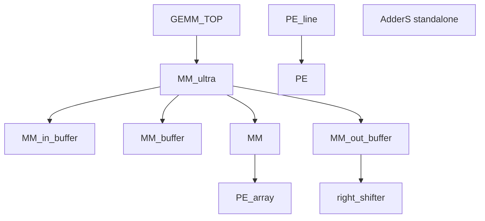
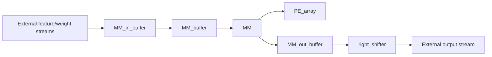
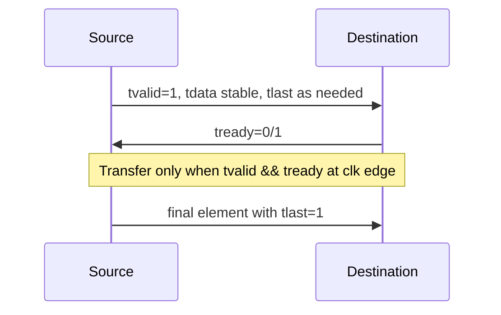
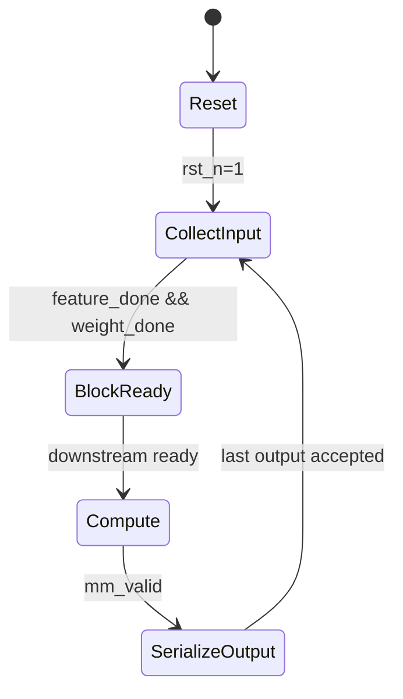
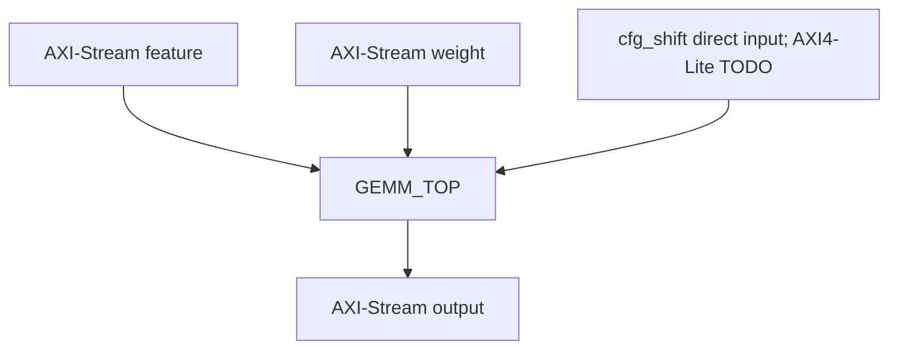

# Mermaid diagrams

## Module hierarchy

```mermaid
graph TD
  GEMM_TOP --> MM_ultra
  MM_ultra --> MM_in_buffer
  MM_ultra --> MM_buffer
  MM_ultra --> MM
  MM --> PE_array
  MM_ultra --> MM_out_buffer
  MM_out_buffer --> right_shifter
  PE_line --> PE
  AdderS[AdderS standalone]
```

## Dataflow

```mermaid
flowchart LR
  EXT_IN[External feature/weight streams] --> INBUF[MM_in_buffer]
  INBUF --> BUF[MM_buffer]
  BUF --> MMCORE[MM]
  MMCORE --> PEA[PE_array]
  MMCORE --> OUTBUF[MM_out_buffer]
  OUTBUF --> SHIFT[right_shifter]
  SHIFT --> EXT_OUT[External output stream]
```

## Valid/ready/last protocol

```mermaid
sequenceDiagram
  participant S as Source
  participant D as Destination
  S->>D: tvalid=1, tdata stable, tlast as needed
  D->>S: tready=0/1
  Note over S,D: Transfer only when tvalid && tready at clk edge
  S->>D: final element with tlast=1
```

## Control/FSM approximation

```mermaid
stateDiagram-v2
  [*] --> Reset
  Reset --> CollectInput: rst_n=1
  CollectInput --> BlockReady: feature_done && weight_done
  BlockReady --> Compute: downstream ready
  Compute --> SerializeOutput: mm_valid
  SerializeOutput --> CollectInput: last output accepted
```

## `GEMM_TOP` stream/control view

```mermaid
flowchart TB
  AXIS_F[AXI-Stream feature] --> GEMM_TOP
  AXIS_W[AXI-Stream weight] --> GEMM_TOP
  CFG[cfg_shift direct input; AXI4-Lite TODO] --> GEMM_TOP
  GEMM_TOP --> AXIS_O[AXI-Stream output]
```
